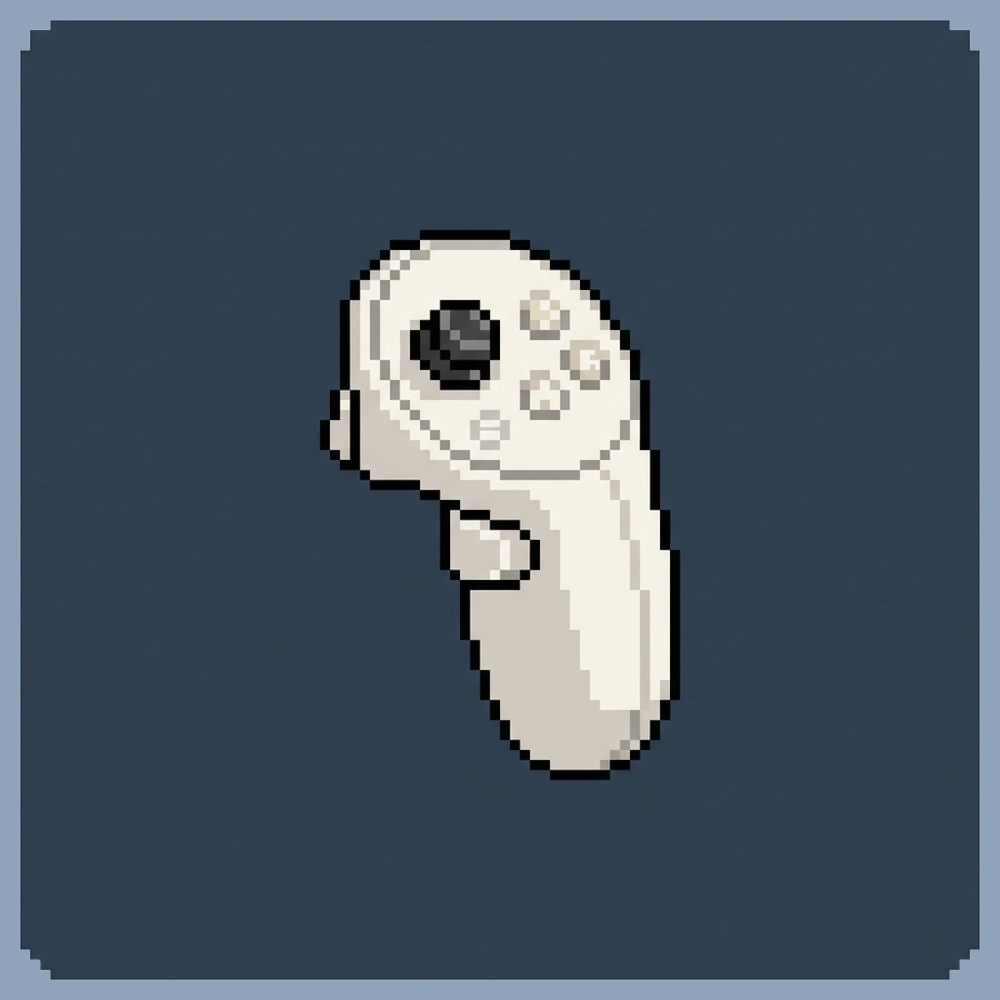

  
  <h1>QuestBridge</h1>
  
Bridge Meta Quest 3, 3S, or 2 controllers directly to standalone Minecraft Java Edition via WebXR

  
  
  

QuestBridge is a Minecraft client-side Fabric mod that bridges Meta Quest 3 controllers directly to Minecraft Java Edition running natively on the headset. It hosts a local WebXR webpage that captures controller inputs and sends them to the running game instance via a low-latency WebSocket server, enabling a console-like immersive experience entirely standalone without a PC.

> [!NOTE]
> This mod was developed specifically for **Minecraft 26.1.2** (Fabric, running inside Amethyst-Android) and has only been tested on this version. Compatibility with other versions is not tested or guaranteed.

---

  <video src="https://github.com/user-attachments/assets/b3d941bd-ead1-49a7-99f9-02467f74109c" width="100%" controls>
    Seu navegador não suporta a exibição de vídeos HTML5.
  </video>

---

## Features

- **Standalone VR/MR Support**: Play Minecraft Java Edition directly on the headset (Quest 3, 3S, or 2) with zero PC connection required.
- **Low-Latency Controller Mapping**: WebXR-based controller capture forwarded over a high-speed local WebSocket (port 7374).
- **Premium Immersive Environments**: Smooth switching between native MR Passthrough, solid backgrounds, custom 360° Skyboxes, and a high-fidelity procedural 3D Space background with dynamic stars and shooting stars.
- **Integrated Controller Haptics**: Native in-game action feedback (breaking blocks, taking damage, eating) transmitted back to controllers with customizable intensity.
- **Persistent Settings**: Saves environment preferences and haptic options across sessions using IndexedDB and LocalStorage.

---

## Requirements

Ensure all of the following requirements are met before starting:

- **Meta Quest 3** (Tested) | **Quest 3S & 2** (Supported).
- **Developer Mode Enabled** on the headset. Refer to the [Official Meta Developer Guide](https://developer.oculus.com/documentation/native/android/mobile-device-setup/) for setup steps.
- **"Seamless Multitasking"** enabled in the headset:
  1. Open Quest Settings.
  2. Navigate to **Experimental**.
  3. Toggle **Seamless Multitasking** to **ON**.

> [!IMPORTANT]
> Without Seamless Multitasking enabled, the browser background will freeze or terminate when Minecraft comes into focus.

  

    
  

- **"Disable Gestures" in Amethyst** (Optional)
  1. Launch Amethyst-Android on the Quest.
  2. Navigate to **Settings** -> **Control Customizations**.

  

    
  

- **[Amethyst-Android](https://github.com/AngelAuraMC/Amethyst-Android/releases)** launcher installed.
- **[Controlify](https://modrinth.com/mod/controlify?version=26.1.2&loader=fabric#download)** and **[Fabric API](https://modrinth.com/mod/fabric-api?version=26.1.2#download)** installed in your mods folder.

---

## Installation

1. **Install Amethyst-Android**: Install the **[Amethyst APK](https://github.com/AngelAuraMC/Amethyst-Android/releases)** on your **MetaQuest** by opening the APK file (or via SideQuest or ADB).
2. **Launch Vanilla Once**: Open Amethyst, log in, and start vanilla Minecraft. Once the main menu loads, exit the game.
3. **Configure Fabric Profile**: Inside Amethyst, create a new Fabric profile.
4. **Access the Game Directory**:
   - Inside the Amethyst-Android app, select your Fabric profile and click **Open Game Directory**.
   - This launches the system's native Android file explorer directly in the active game directory.
   - *Tip:* If no files or folders appear, click the **three dots** in the top right-hand corner of the file explorer and select **Show Hidden Files**.
5. **Install Mods**:
   - Locate the **`mods`** directory inside the opened folder (create it if it doesn't exist).
   - Place the downloaded `questbridge-x.y.z.jar` into this directory alongside **Controlify** and the **Fabric API**.

---

## Usage

<!-- SCREENSHOT: WebXR controller.html UI interface on the Meta Quest Browser showing the Environment Grid and Haptic Slider -->

  

1. **Launch Minecraft**: Open Amethyst and boot the game using your configured Fabric profile.
2. **Launch Quest Browser**: Open the native Meta Quest Browser and navigate to:
    > http://localhost:7373
3. **Select Environment**: Pick your preferred theme on the Web UI (e.g., **Pass** for Mixed Reality Passthrough, **✦ Space** for the custom 3D cosmos background).
4. **Enter VR**:
   - Click the **Enter VR** button on the page.
   - The browser will ask for immersive permissions. Accept them.
5. **Position Minecraft**:
   - Press the **Meta button** on the right controller to bring up your Quest 2D app panel.
   - Drag the Minecraft window into a comfortable 3D space in front of you.

> [!NOTE]
> While playing, keep your controller pointer beams aimed slightly away or downwards from the 2D Minecraft window. Pointing the Quest beam directly at the Minecraft window shifts system focus to it, which pauses the background browser's input bridge. 
> 
> *Aiming directly at the window remains useful when navigating inventories, game menus, settings.*

<!-- SCREENSHOT: Final setup showcasing the immersive WebGL space environment with the Minecraft Java panel correctly positioned -->

  

  

---

## Amethyst Custom Control Layout (Recommended)

To make standalone play much easier (such as opening the `ESC` menu or virtual keyboard `T` for chat without a physical keyboard), you can import the custom QuestBridge control map preset provided in this repository.

### How to Import:
1. Download or copy the [questbridge_cmap.json](amethyst/questbridge_cmap.json) file.
2. Place it on your Quest headset's internal storage inside the Amethyst custom controls import folder.
3. Open **Amethyst-Android** on your Quest headset.
4. Navigate to **Settings** -> **Control Customizations**.

  

5. Select **Edit Custom Controls**.

  

6. Click the **Gear icon** located at the top-center of the screen.
7. Click **Load** and select `questbridge_cmap.json`.

  

---

## Troubleshooting

| Issue | Potential Cause | Resolution |
| :--- | :--- | :--- |
| **Inputs not registering** | Seamless Multitasking is disabled | Ensure **Seamless Multitasking** is turned ON in the Quest Experimental settings. |
| **Controllers disconnected** | Focus shift | Confirm that you are not pointing the controllers directly at the Minecraft panel. |
| **Page not loading** | Server port conflict or mod not running | Verify Minecraft has fully loaded Amethyst and ensure the browser is pointed to `http://localhost:7373`. |
| **Passthrough mode is black** | Permission block or session type issue | Ensure you selected the **Pass** card *before* pressing **Enter VR** so that the system correctly initializes an `immersive-ar` session. |
| **Haptics missing** | Intensity set to 0% | Adjust the **Haptic Intensity** slider to a value greater than 0% on the Web UI. |

---

## Contributing

Contributions are welcome! If you want to improve the WebGL environment rendering, optimize WebSocket packets, or refine gamepad remappings, feel free to open a Pull Request. For major changes, please open an issue first to discuss what you would like to change.

---

## License

<!-- TODO: Clarify which license you would like to apply to the repository. The default recommendation is MIT. -->

This project is licensed under the MIT License - see the [LICENSE](LICENSE) file for details.
